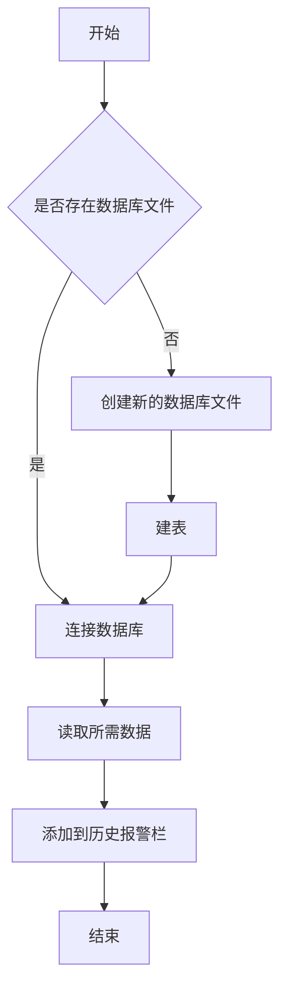

<center><font size=16>报警和日志模块开发文档</font></center>

<div STYLE="page-break-after: always;"></div>

[TOC]

<div STYLE="page-break-after: always;"></div>

# 1.数据类型

## 1.1 报警模块
```csharp
public class CurrentAlarm
{
            public int Number { get; set; }				//报警信息的序号
            public string HappenTime { get; set; }		//报警信息的发生时间
            public string Code { get; set; }	        //报警信息的代码(AlarmHelpID)
            public string AlarmCode { get; set; }		//报警信息的错误码
            public string Content { get; set; }			//报警信息的内容
            public string Type { get; set; }			//报警信息的种类
            public string AlarmType { get; set; }		//报警信息的类型
            public string IsRemoved { get; set; }		//报警信息时候移除的标志
            public string RemovedTime { get; set; }		//报警信息的移除时间
}/*当前警报结构*/
```
## 1.2 日志模块
```csharp
enum LogMessageType
{
            Normal,         //普通
            EnterModule,    //进入模块
            AboutAxis,      //坐标相关
            WarningInfo     //报警信息
}/*日志模块的内容类型*/
```

<div STYLE="page-break-after: always;"></div>

# 2.函数

## 2.1 报警模块

### public void CreateNewDB(string DBName)  
>Description：创建SQLite数据库；  
>Input：入口参数:DBName：要创建的数据库的名称；  
>Output：无;   
>Return：无;  

### public void ConnectDB(string DataSource)  
>Description：连接SQLite数据库；  
>Input：入口参数:DataSource：要连接的数据库的名称；  
>Output：无;   
>Return：无;  

### public void CreateTable()  
>Description：如果bin目录下没有找到数据库,创建新数据库后建表；  
>Input：入口参数:无  
>Output：无;   
>Return：无;  

### public void ExcuteSql(string sql)  
>Description：执行传入的sql语句；  
>Input：入口参数:sql语句  
>Output：无;   
>Return：无;  

### public DataTable SelectSql()  
>Description：查询数据中表中的内容；  
>Input：入口参数:  
>&emsp;1.无,默认查询表中所有内容  
>&emsp;2.sql语句,按照传入的sql语句进行查询
>Output：无;   
>Return：返回DataTable类型的读取结果;  


### public void Close()  
>Description：关闭打开的数据库；  
>Input：入口参数:无  
>Output：无;   
>Return：无;  

<div STYLE="page-break-after: always;"></div>
## 2.2日志模块

### public static string GetLanguagePhraseByResourceKey(string resourceKey)
>Description：通过resourceKey获取对应的中文翻译；  
>Input：入口参数:字符串,Key值    
>Output：无;   
>Return：字符串,Value值;

### public static void SaveNormal(string message,string messageType)  
>Description：将message和messageType写入到日志中；  
>Input：入口参数:
&emsp;1.字符串,消息内容  
&emsp;2.字符串,消息类型  
>Output：无;   
>Return：无;

**写日志使用示例:**
```
BodorLaserWPFUtil.Log.TextLog.SaveNormal("Enter Module:DiagnoseWarning",     BodorLaserWPFUtil.ClsConfig.GetLanguagePhraseByResourceKey(BodorLaserWPF.DiagnoseLog.View.SystemLog.LogMessageType.EnterModule.ToString());
```

### public void AddToLogInfo(string[] ContentLines)  
>Description：将传入的内容添加到日志展示的RichTextBox控件里；  
>Input：入口参数:字符串数组  
>Output：无;   
>Return：无;

### public void getDetial(string Line, ref string time, ref string messageType, ref string message)  
>Description：将传入的字符串解析，得到消息时间，消息内容，消息类型；  
>Input：入口参数:  
>&emsp;1.字符串，待解析的字符串  
>&emsp;2.字符串，消息时间（不关心传入的时候的值）  
>&emsp;3.字符串，消息类型（不关心传入的时候的值）  
>&emsp;4.字符串，消息内容（不关心传入的时候的值）  
>Output：  
>&emsp;1.字符串，消息时间  
>&emsp;2.字符串，消息类型  
>&emsp;3.字符串，消息内容;   
>Return：无;

### public int ConvertMessageType(string messageType)  
>Description：将解析出的消息类型转换为枚举型对应的int值；  
>Input：入口参数:字符串，消息类型  
>Output：无;   
>Return：消息类型对应的枚举型int值;  

### public void GetDateAndLanuchTime(ref List\<string>timeList,ref List\<string>dateList,ref List\<string> lauchTimeList,string logText,string pattern)  

>Description：传入内容，使用正则表达式，获取程序启动时的日期，登录时间；  
>Input：入口参数:  
>&emsp;1.字符串列表，存放时间（包含日期和时间，例如“（03/26 13:42:24）”）（不关心传入的时候的值）  
>&emsp;2.字符串列表，存放日期  （不关心传入的时候的值）  
>&emsp;3.字符串列表，存放登录时间（只含时间）（不关心传入的时候的值）  
>&emsp;4.字符串，需要检索的内容  
>&emsp;5.字符串，正则表达式  
>Output：  
>&emsp;1.字符串列表，存放时间（包含日期和时间，例如“（03/26 13:42:24）”）  
>&emsp;2.字符串列表，存放日期  
>&emsp;3.字符串列表，存放登录时间（只含时间）;     
>Return：无;  
<div STYLE="page-break-after: always;"></div>

# 3.小模块流程图

## 3.1历史报警流程

<center><图1.1 历史报警流程图></center>  
<div STYLE="page-break-after: always;"></div>

## 3.2添加菜单流程

```flow
st=>start: 开始
e=>end: 结束
op=>operation: 获取存放日志文件下所有文件名
op1=>operation: 读取文件内容
op2=>operation: 获取日期和启动时间
op3=>operation: 添加到菜单
cond=>condition: 所有文件是否读完
sub1=>subroutine: 循环
e=>end: 结束框
st->op->op1->op2->op3->cond
cond(yes)->e
cond(no)->sub1(right)->op1
```

<center><图1.2 添加菜单项流程图></center>
<div STYLE="page-break-after: always;"></div>

## 3.3添加日志内容流程


<center><图1.3 添加日志内容流程图></center>
<div STYLE="page-break-after: always;"></div>